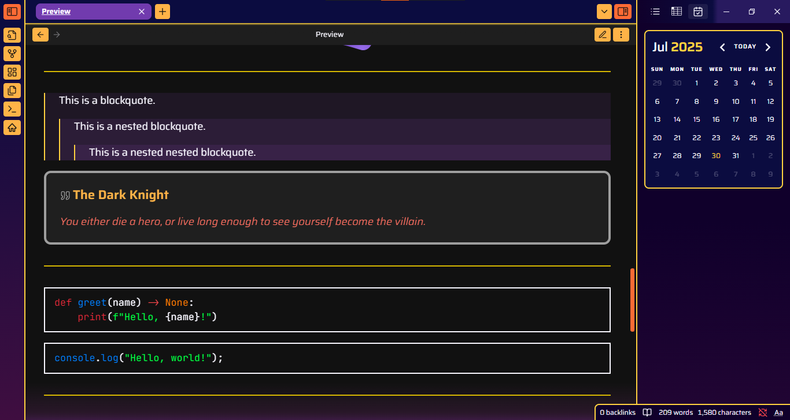
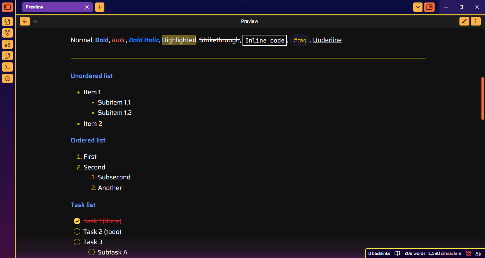

# 🌌 Omega — An Obsidian Theme

> *"A deep space trip through your second brain."*

**Omega** is a dark mode-only Obsidian theme designed for those who think in stars. Inspired by the glowing chaos of nebulae and the burning edges of collapsing stars, Omega brings you a vibrant yet immersive palette made for late-night thinking, digital spellcraft, and cosmic-level note-taking.

---

## ✨ Features

- A bold, custom **cosmic color palette**.
- Minimal yet refined **gradient accents** — vibrant enough to feel dynamic, but never overwhelming.
- Toggle underline formatting using `==~~Underline~~==` for enhanced text emphasis.
- Highlighting (`==Highlight==`) within a table cell will visually emphasize the entire cell.
- Exclusively dark mode.

---

## 🛠️ Status

Omega is still in early development!  
It's not as feature-rich as the veteran themes (yet), but it's vibing hard and growing fast. Expect visual tweaks, expanded plugin support, and performance improvements in future updates. Contributions & feedback are very welcome.

---

## 📸 Preview

---

## ☕ Support / Donate

If you like the vibe and want to fuel the development (or just buy me a digital coffee), donations are always appreciated:

**[Donate via Ko-fi](https://ko-fi.com/omegac)**