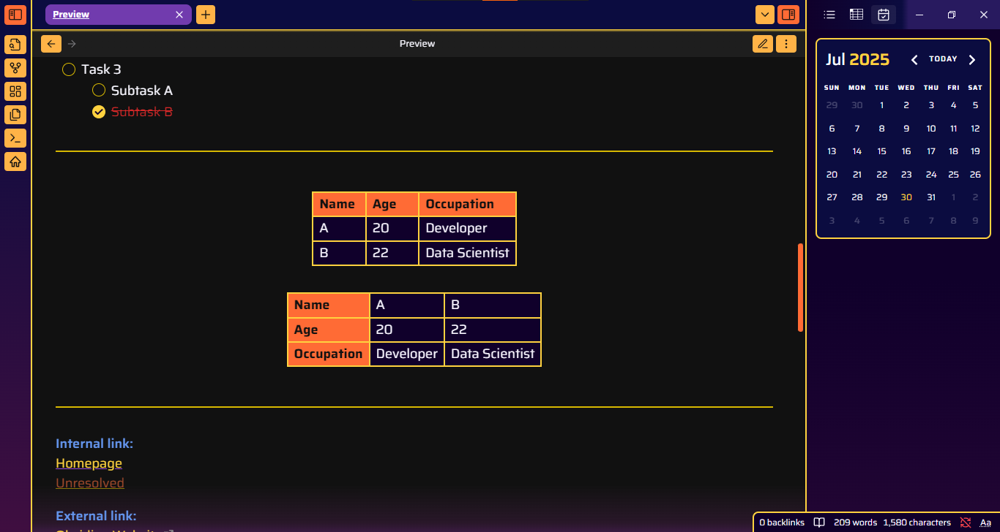

# 🌌 Omega — An Obsidian Theme

> *"A deep space trip through your second brain."*

**Omega** is a dark mode-only Obsidian theme designed for those who think in stars. Inspired by the glowing chaos of nebulae and the burning edges of collapsing stars, Omega brings you a vibrant yet immersive palette made for late-night thinking, digital spellcraft, and cosmic-level note-taking.

---

## ✨ Features

- A bold, custom **cosmic color palette**.
- Minimal but elegant **gradient touches** — just enough to feel alive, but not enough to burn your eyes.
- Currently supports core Obsidian components — plugin support is expanding over time.
- Exclusively dark mode.

---

## 🛠️ Status

Omega is still in early development!  
It's not as feature-rich as the veteran themes (yet), but it's vibing hard and growing fast. Expect visual tweaks, expanded plugin support, and performance improvements in future updates. Contributions & feedback are very welcome.

---

## 📸 Preview

---

## ☕ Support / Donate

If you like the vibe and want to fuel the development (or just buy me a digital coffee), donations are always appreciated:

**[Donate via Ko-fi](https://ko-fi.com/omegac)**